# Linux-Magics

Linux has many weird, unexpected and funny tricks & behaviors that make you say WTF.

Let's investigate them and learn about how Linux works under the hood.

## 0x01 - Execute ELF without executable permissions

Create new copy of `id` binary without executable permissions

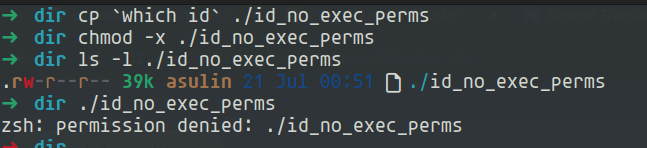

Great - not working

Let's take the first string of the binary and use it to execute it

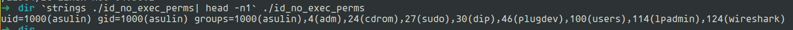

WTF

What is that string?

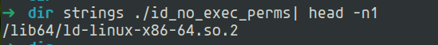

We invoked the dynamic loader with the ELF file as an argument

The dynamic loader is responsible for starting dynamically linked programs - loads the ELF binary into memory, resolves and links shared libraries and transfers control to the program’s main() function

Dynamic loader path located in ELF header - PT_INTERP (Program Header)

But how is the dynamic loader invoked normally?

binfmt_elf - the kernel checks binary magic bytes (`\x7fELF`), parses the program headers to extract PT_INTERP and executes the interpreter (aka dynamic loader) instead of the binary directly, passing the ELF file as its first argument

**Resources:**
- `man 8 ld.so`
- `man 5 elf`
- https://elixir.bootlin.com/linux/v4.8/source/fs/binfmt_elf.c

## 0x02 - [

Have you ever used if statements in bash?

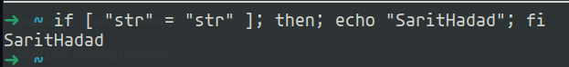

How clean and elegant it is.

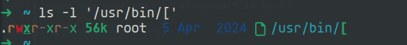

WTF, `[` is a binary?

That binary just gets a condition and returns true or false

What about `]`? it is just an argumant, the `[` binary checks that the last argument is `]`

`[` and `test` are effectively the same command

`/usr/bin/[` could be also a symlink to `/usr/bin/test` on some Linux distros

Now, most shells has `[` as a shell built-in command

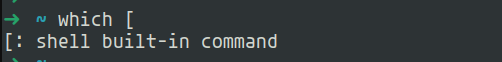

**Resources:**
- `man 1 test`

## 0x03 - Linux boot by Microsoft Corp.

ELF is the format for everything in Linux - also the kernel

Right?

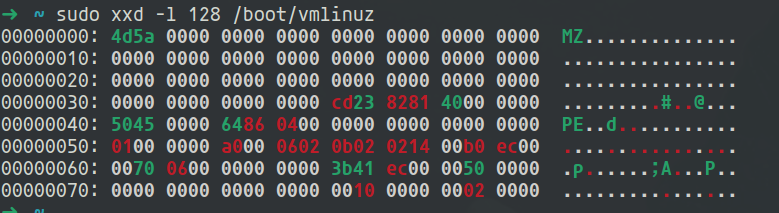

WTF, why does my kernel have MZ and PE headers?

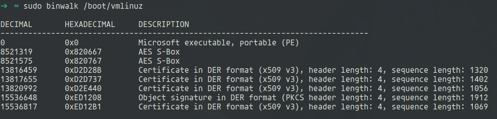

UEFI is the modern replacement for the old BIOS firmware

It uses PE file format to load bootloaders and operating systems

To support booting on UEFI systems, the Linux kernel is wrapped inside a PE container

This wrapping lets UEFI firmware load the kernel as a normal EFI executable

The actual Linux kernel is still an ELF binary inside this PE wrapper

On BIOS systems, bootloaders ignore the PE wrapper and directly load the compressed ELF kernel - this design allows a single kernel image to boot on both BIOS and UEFI platforms without modification

You could make your kernel supports UEFI booting in build time - `CONFIG_EFI.*`

## 0x04 - Invisible Threads

Let's list some running threads

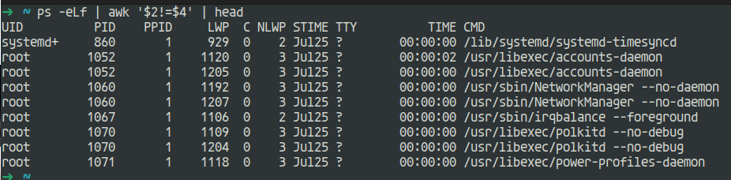

Let's pick the first one - PID is 860, and LWP (lightweight process, aka TID) is 929

We could list and access threads of a process under `/proc/<PID>/task`

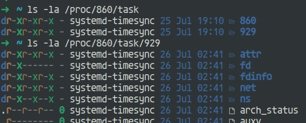

In Linux, a thread is actually a process - threads and processes are both implemented as `tasks` in the kernel. A thread is created using `clone()` with flags that tell it to share certain things with its parent

So, we could find our TID under `/proc` right?

:(

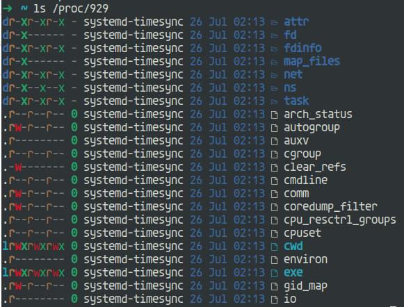

WTF

Why does the thread's directory isn't shown when ls `/proc` directory?

They are hidden from directory listings

- `/proc` was designed to show processes - threads are considered part of a single process
- If every thread appeared as a process in `/proc`, the directory would be flooded with thousands of entries, making it harder to navigate or parse

So, why threads can be accessed directly by `/proc/<TID>`?

As we explaind above - a thread is actually a process, lightweight process

`task_struct` - `pid` is the task id, `tgid` is the thread group id

Main thread - pid == tgid

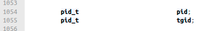

So, PID (aka main thread id) and TID uses the same identifier field -> `/proc/<PID>` is the same as `/proc/<TID>`

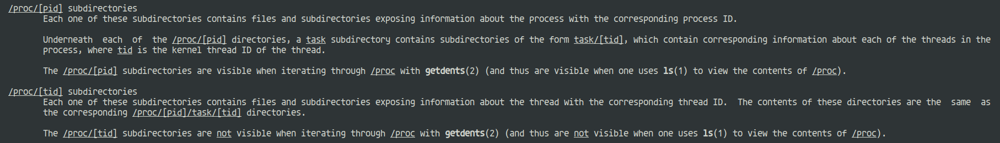

**Resources:**
- `man 5 proc`
- https://elixir.bootlin.com/linux/v6.15.8/source/include/linux/sched.h#L813

## 0x05 - Delete a file without permissions

Let's create a file and set no permissions at all

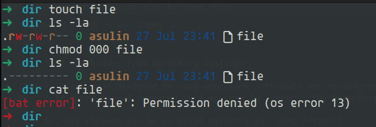

Great

Would it work to delete the file? we have no permissions

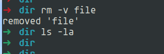

WTF, why could we delete the file without any permissions?

File deletion depends on the permissions of the directory containing the file, not the file itself

## 0x06 - User permissions > Group permissions

Let's create a new user named `sarit`, and a group named `hadad` - `sarit` is a member of `hadad`

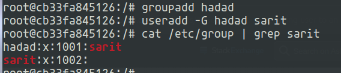

Now create a file with owner user `sarit` and owner group `hadad`

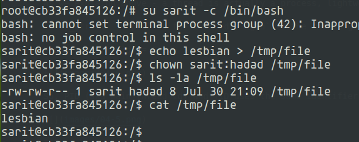

Let's remove permissions for the user

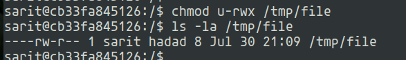

Would it work to read the file?

`sarit` is a member of `hadad`, it sohuld work

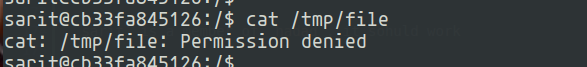

WTF

Only the owner permissions applied, not the group permissions — even if `sarit` is a member of `hadad`

The kernel checks in this order:

1. If the process's effective UID matches the file's owner UID, then the file owner’s permissions apply.

2. Else, if the process’s group matches the file group, then the group permissions apply.

3. Otherwise, the "other" permissions apply.

**Resources**:
- `man 5 acl` (ACCESS CHECK ALGORITHM)
- https://elixir.bootlin.com/linux/v6.13/source/fs/namei.c
